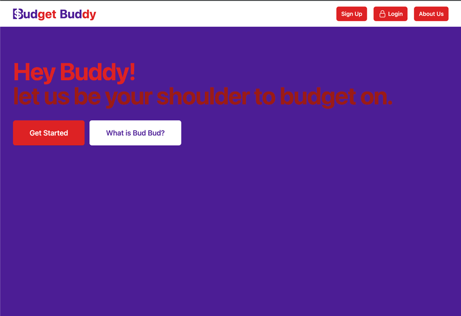

# Budget Buddy

## Description
Budget Buddy is a hands-on and easy-to-use money management web application. The app allows  users to view, manage, and distribute their expenses all in one user-friendly dashboard. This full-stack web application was built using the MVC paradigm, handlebars.js and tailwind as the front-end UI and JS for scripting.


### User Story
```md
As a daily consumer and household member
I want the ability to manage my income,
TO create an account that will hold all of my budget information,
I also want to be able to create, edit, and remove my entries,
SO THAT I can easily distribute and manage my expenses as I deem it necessary. All in one place. 
```


### Application Specifics

This application uses a variety of different NPM packages; most are to handle the MVC specifics, like express, connect-session-sequelize, and handlebars. Others are used for calculations and password protection.

### Dependencies

    1. Bcrypt
    2. Connect-session-sequelize
    3. dotenv
    4. express
    5. express-handlebars
    6. express-session
    7. handlebars
    8. mysql2
    9. precise-calculator

### Installation and Run

    1. Installation:
        A. Please clone the repository onto your machine via git
        B. Install all NPM packages in the root folder using the terminal command 'npm i'
        C. Create a .env file in the Assets folder with the following:
            i. DB_NAME='finance_db'
            ii. DB_USER='{your mysql username}'
            iii. DB_PASSWORD='{your mysql password}'
    2. Running Locally:
        A. First, create the database by launching mysql in the /Assets/database/ folder. Log in, and then use the mysql command 'source schema.sql;' in the terminal.
        B. Start the server by using the terminal command 'node server.js' when in the /Assets folder.
        C. Navigate to localhost:3001/ by typing it in the browser, or by clicking on the resulting URL in the terminal
    3. Running on a cloud based server:
        A. Refer to your cloud based server instructions for uploading the repository and deploying

### How to Use

    1. Account Creation and Log In
        A. To being using the application, you must make an account first, unless you already have one. Click the Sign Up button in the top right corner, enter your information, and then hit create account.
            i. Be aware that email address must be unique and passwords must be longer than 4 characters.
        B. Once you have signed up, you can continue to use your account by clicking in the Log In button in the top left corner.
    2. Dashboard
        A. The dashboard displays your budgets, up to your 5 most recent expenses, and up to your 5 most recent incomes. The top right of the page contains useful navigation links.
    3. Adding
        A. To start adding, click on any of the 'add _____' buttons.
            i. Adding a Budget Category
                a. Enter in the category of the budget and then the amount in the two provided text boxes. For example, 'Food' could be a name and '400' could be the amount.
            ii. Adding an Expense
                a. Enter in the name of the expense, the amount, and then use the drop down menu to select the budget category. Click submit after you are done. For example, 'Groceries' could be the name, '50' could be the amount, and 'Food' could be the category
                b. You MUST have at least one budget category before adding any expenses.
            iii. Adding income
                a. Enter in the source income and then the amount. For example, 'Paycheck' could be the source and '2000' could be the amount
    4. Editing and Deleting
        A. To edit any budget, expense, or income, click on the pencil icon next to eny entry on the dashboard. A little pop up will appear asking for the new name and amount. Both must be submitted for the change to submit. Click submit when you are done.
        B. To delete any budget, expense, or income, click the trash can icon next to any entry on the dashboard. A confirmation message will appear and ask to confirm your deletion.
    5. Viewing
        A. Budget
            i. Click on the 'View All' button located in the Budget.
            ii. To view all expenses related to a single budget category, click the eye emoji on the right hand side.
        B. Expenses and Income
            i. Click on the 'View All' button located in their respective locations.

### Future Development

    1. Households
       A. Some users may have multiple homes they need to budget for, and we plan to implement functionality to create, edit, and delete households that contain their own budgets, expenses, and income. There would be a 'default' view, which would show all households, budget amounts, total amount of expenses, and total amount of income, and the user could switch between the macro 'default' view and each individual household for a more in depth look.
    2. Sorting
        A. We plan to allow users to sort their budgets, expenses, and income by amounts, name, type, and date in the View All page.
        We would also like to allow users to re-assign the different expenses they have entered.
    3. Month to Month
        A. We plan to implement a month to month budgeting functionality that users can use to see their monthly budgets, expenses, and incomes with statistics. Budget categories would be carried over each month with expenses and income being reset. Statistics would show the net income minus expenses, budgets that the user went over or under with a percentage amount and dollar amount, and an overall user net savings that sums all income and all expenses on the account.
    4. Excel Exporting
        A. We plan to allow the user to export their budget, expenses, and income to an excel spreadsheet.

### Credits

    1. Contributors:
        A. Ashlynn Landry
            i. [GitHub](https://github.com/ashclandry)
        B. Cristina Yunes
            i. [GitHub](https://github.com/Yuyitax)
        C. Indigo Fobes
            i. [GitHub](https://github.com/IndigoFobes)
        D. Jeremy Parson
            i. [GitHub](https://github.com/parsonjd)
        E. Shawn Canavan
            i. [GitHub](https://github.com/shawnbandy)

## Visuals:



## Launch website
** Please use the following link to launch Budget Buddy: [Click Here](https://budget-buddy-group-project.herokuapp.com/)

---
© 2022 The Budget Buddy. All Rights Reserved.